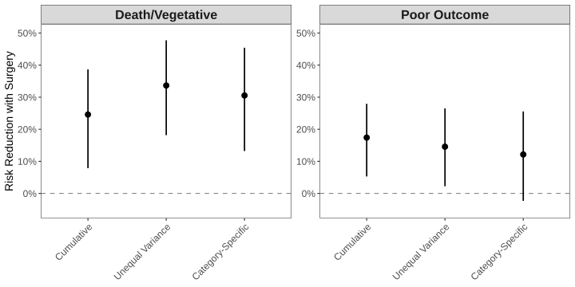

## Background

-   RESCUEicp trial (2016): 408 patients with refractory intracranial hypertension randomized to surgery vs medical care[^1]

[^1]: Hutchinson PJ, Kolias AG, Timofeev IS, Corteen EA, Czosnyka M, Timothy J, Anderson I, Bulters DO, Belli A, Eynon CA, Wadley J. Trial of decompressive craniectomy for traumatic intracranial hypertension. New England Journal of Medicine. 2016 Sep 22;375(12):1119-30.

<!-- -->

-   Original analysis abandoned due to failed chi-squared test for proportional odds assumption — but no alternative models were explored
-   **Our question**: Can multiverse analysis reveal consistent treatment effects across different statistical models?
-   *Multiverse analysis*: test multiple valid statistical models to see if conclusions change.[^2]

[^2]: Gelman A, Vehtari A, Simpson D, Margossian CC, Carpenter B, Yao Y, et al. Bayesian Workflow \[Internet\]. arXiv \[stat.ME\]. 2020. Available from: http://arxiv.org/abs/2011.01808

## Methods

-   **Data:** 6-month GOSe scores from RESCUE-ICP trial (n=408)

-   **Models tested:**[^3]

    -   standard cumulative ordinal regression

    -   cumulative ordinal regression with unequal variances

    -   adjacent category ordinal regression with category-specific effects

-   **Key outcomes:** Death/vegetative state (GOSe 1-2) and poor outcome (GOSe 1-3)

-   **Limitations**: Secondary analysis of published trial data

[^3]: Bürkner P-C, Vuorre M. Ordinal Regression Models in Psychology: A Tutorial. Advances in Methods and Practices in Psychological Science. 2019 Mar 1;2(1):77–101.

## Surgery reduces risk of unacceptable outcomes in severe TBI

## Conclusion

-   Model choice does not change clinical conclusions — surgery consistently beneficial

-   **Bottom line:** RESCUEicp provides evidence that decompressive craniectomy reduces the risk of unacceptable outcomes in severe TBI, regardless of statistical model chosen to analyze the trial data.

## Big picture

-   Neurosurgical RCTs: rare resource (\<10 per year)

-   Traditional approach: abandon analysis if assumptions fail

-   **Better approach: test if violations change conclusions.**

-   Don't sacrifice clinical insight to statistical dogma.
